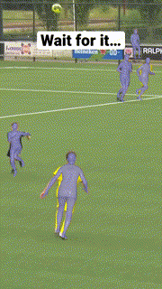
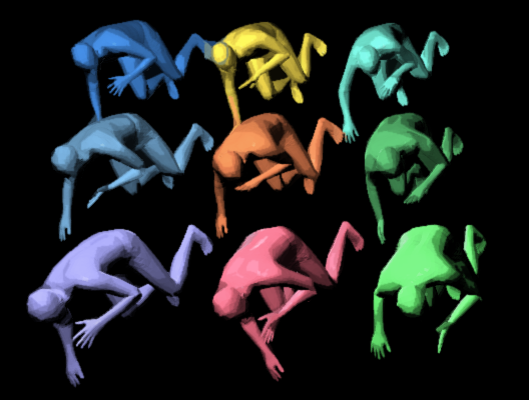

# Learning Analytical Posterior Probability for Human Mesh Recovery
### [Project Page](https://netease-gameai.github.io/ProPose/) | [Paper](https://netease-gameai.github.io/ProPose/static/assets/CVPR2023_ProPose.pdf) | [推文](https://mp.weixin.qq.com/s/DdCLB1pghVLD3yPh8QeWxw)

> [Learning Analytical Posterior Probability for Human Mesh Recovery](https://netease-gameai.github.io/ProPose/static/assets/CVPR2023_ProPose.pdf)    
> Qi Fang, Kang Chen, Yinghui Fan, Qing Shuai, Jiefeng Li, Weidong Zhang  
> CVPR 2023  

<div align="left">
  
<br>
<sup>
Single-frame results. (@<a href="https://www.youtube.com/watch?v=hS3UGaZSAuk&ab_channel=Joris">soccer</a>, @<a href="https://www.youtube.com/watch?v=uqOWoeJ7bpo&ab_channel=urbanamadei">parkoour</a>)
</sup>
</div>

## Installation  
```
conda create -n propose python=3.8
conda activate propose
pip install -r requirements.txt
# visualization
pip install opendr
```
See this [issue](https://github.com/akanazawa/hmr/issues/82#issuecomment-557430371) if errors occur when installing opendr.

## Data
### SMPL Files and Pretrained Model  
- Create a folder called `model_files`.
- Download smpl files from [here](https://drive.google.com/file/d/1BKLS7gTVP6Rsw775r12OyQUB6At1tJBv/view?usp=share_link) or the official [website](https://smpl.is.tue.mpg.de/). Unzip it and place it at `model_files/`. 
- Download the [pretrained model](https://drive.google.com/file/d/1F0fnbRxvB0xE117iGxUiDpG-CFzJqN2r/view?usp=share_link) and place it at `model_files/`.

### Training Dataset  
Download relevant datasets, including but not limited to [*Human3.6M*](http://vision.imar.ro/human3.6m/description.php), [*MPI-INF-3DHP*](https://vcai.mpi-inf.mpg.de/3dhp-dataset/), [*MSCOCO*](https://cocodataset.org/), [*3DPW*](https://virtualhumans.mpi-inf.mpg.de/3DPW/), [*EFT*](https://github.com/facebookresearch/eft), [*AGORA*](https://agora.is.tue.mpg.de), [*COCO-WholeBody*](https://github.com/jin-s13/COCO-WholeBody). 

We prepare the data following [HybrIK](https://github.com/Jeff-sjtu/HybrIK#fetch-data). Furthermore, the details of annotation structure can be found in [dataset](./propose/datasets/#dataset-notes).

## Quick Demo
```
python scripts/demo.py --img-dir ./examples --out-dir dump_demo --ckpt './model_files/propose_hr48_xyz.pth'
```

## Train
```
# The distributed training in scripts/train.sh can be opened if multiple nodes are available.
sh ./scripts/train.sh exp_name ./configs/smpl_hm_xyz.yaml
```

## Discussion
See [discussion](./discussion.md) for clarifications and limitations. Please open an issue (preferred) or send an email to Qi Fang (fangqi19@zju.edu.cn) if you have any questions.

## TODO
- [ ] Evaluation part (original).
- [ ] Saved training annotations.
- [ ] Distribution visualization.

## Citation  
```
@inproceedings{fang2023propose,
  title     = {Learning Analytical Posterior Probability for Human Mesh Recovery},
  author    = {Fang, Qi and Chen, Kang and Fan, Yinghui and Shuai, Qing and Li, Jiefeng and Zhang, Weidong},
  booktitle = {CVPR},
  year      = {2023},
}
```

## Acknowledgement  
We would like to thank Dingwei Wu for the advice about rendering in Blender, Chi Zhou and Yanjun Li for the discussion. Some of the code is adapted from [HybrIK](https://github.com/Jeff-sjtu/HybrIK), [HierarchicalProbabilistic3DHuman](https://github.com/akashsengupta1997/HierarchicalProbabilistic3DHuman), [SMPLX](https://github.com/vchoutas/smplx), [SPIN](https://github.com/nkolot/SPIN), [MeTRAbs](https://github.com/isarandi/metrabs), [HRNet](https://github.com/HRNet/HRNet-Image-Classification).
